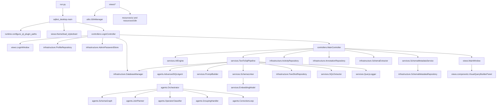

# SQLBot Project Graph

Last scanned: 2026-06-01

This document maps the current SQLBot Desktop codebase at a decision-ready level. It is intended for onboarding, impact analysis, and future agent prompts.

## Root Map

```text
.
+-- run.py                         # local/dev entrypoint
+-- config.yaml                    # self-correction defaults
+-- SQLBot.spec                    # PyInstaller bundle definition
+-- requirements*.txt              # Python/runtime dependency manifests
+-- scripts/                       # build, driver, and evaluation commands
+-- docs/                          # project docs and evaluation dataset
+-- data/                          # local runtime JSON/SQLite data
+-- resources/
|   +-- ui/                        # QSS themes and SVG icons
|   +-- i18n/{vi,en,jp}/           # tiered *.strings.xml localization files
+-- tests/                         # unittest suite by subsystem
+-- src/sqlbot_desktop/
    +-- main.py, runtime.py        # QApplication bootstrap and Qt plugin path setup
    +-- models/                    # dataclasses and enums shared across layers
    +-- controllers/               # UI orchestration and background workers
    +-- views/                     # PySide6 windows, dialogs, and components
    +-- infrastructure/            # persistence, SQLAlchemy DB access, schema extraction
    +-- services/                  # AI, prompt, schema, query, evaluation services
    +-- agents/                    # advanced SQL planning/orchestration helpers
    +-- utils/                     # i18n manager
```

## Layer Graph



## Runtime Flows

### Application Startup

1. `run.py` inserts `src/` into `sys.path`.
2. `sqlbot_desktop.main.main()` configures Qt plugin paths, creates `QApplication`, loads QSS, creates `LoginController`, then starts the event loop.
3. `LoginController` loads profiles, shows `LoginWindow`, and waits for connection or connection-management actions.

### Login and Connection

1. `LoginWindow` emits `connect_requested(ConnectionProfile, username, password, remember)`.
2. `LoginController.connect()` calls `DatabaseManager.open_connection()`.
3. `DatabaseManager` supports `MYSQL` and `POSTGRESQL` through SQLAlchemy URLs using `pymysql` and `psycopg`.
4. On success, `MainController` is constructed with the active `DatabaseManager` connection name.

### Connection Management

1. Connection management is password gated by `AdminPasswordDialog` and `AdminPasswordStore`.
2. `ConnectionManagerDialog` uses `ProfileRepository` for `data/connections.json`.
3. `ConnectionFormDialog` supports add/edit/test and `Connect & Get Schema`.
4. Passwords are not persisted in connection profiles.

### Schema Extraction and Annotation

1. `SchemaExtractor` reads tables, columns, foreign keys, sample values, and enum-like values from the active SQLAlchemy connection.
2. `SchemaAnnotationDialog` and `SchemaAnnotationWidget` edit business labels/descriptions.
3. `AnnotationRepository` persists annotations under `data/annotations/*.annotations.json`.
4. `SchemaMetadataService` imports `TableInfo` into local `ColumnMetadata`.
5. `SchemaMetadataRepository` stores enriched metadata in `data/schema_metadata.sqlite`.

### Text-to-SQL Generation

1. `MainWindow.generate_requested` routes to `MainController.generate_sql()`.
2. `MainController` starts a `BackgroundTask` on a `QThread`.
3. `TextToSqlPipeline.generate()` builds schema context through `SchemaLinker`.
4. The pipeline first tries `AdvancedSQLAgent`; if it cannot produce a query, it falls back to `PromptBuilder` + `AIEngine.generate_prompt()`.
5. `SQLExtractor` and `QueryValidator` filter generated SQL to safe SELECT statements.
6. If a database executor is available, `DatabaseManager.execute_select()` validates and executes the first SELECT.
7. Execution errors are fed into the next prompt until `max_retries` is reached.

### AI Backend Load and Unload

1. AI settings are collected into `AIModelConfig`.
2. `AIEngine.load()` unloads any current model first.
3. Local mode imports `llama_cpp.Llama` lazily and loads a `.gguf` file.
4. API mode stores an OpenAI-compatible chat completions endpoint/model and optional API key.
5. `AIEngine.unload()` clears the model/config and runs garbage collection.

### Query Execution and Results

1. User-selected SQL is read from `MainWindow.sql_editor`.
2. `QueryValidator.is_readonly_select()` rejects non-SELECT, dangerous keywords, and stacked statements.
3. `DatabaseManager.execute_select()` executes with a row cap and returns `QueryExecutionResult`.
4. `QueryResultsDialog` renders columns/rows and exports CSV.

### History and Bookmarks

1. `ActivityRepository` stores history and bookmarks in `data/sqlbot_activity.sqlite`.
2. `HistoryDialog` filters and reloads generated attempts.
3. `BookmarksDialog` stores named SQL snippets and can reload them into the main window.

### Settings, Theme, and I18n

1. `SettingsDialog` hosts AI settings and schema annotation settings.
2. `AISettingsRepository` persists AI configuration to `data/ai_settings.json`.
3. `I18nManager` loads `resources/i18n/<lang>/*.strings.xml` and uses `QSettings` for language preference.
4. `views.theme` loads `resources/ui/styles/light.qss` or `dark.qss`.

## Subsystem Dependency Table

| Subsystem | Primary modules | Inbound callers | Outbound dependencies |
|---|---|---|---|
| Bootstrap | `run.py`, `main.py`, `runtime.py` | OS/user, PyInstaller EXE | PySide6, `LoginController`, QSS resources |
| Login/Auth | `LoginController`, `LoginWindow`, `AdminPasswordStore` | Bootstrap, connection dialogs | `ProfileRepository`, `DatabaseManager`, admin password dialogs |
| Connection/DB | `DatabaseManager`, `ProfileRepository`, connection dialogs | Login, main controller, tests | SQLAlchemy, `pymysql`, `psycopg`, `QueryValidator` |
| Main UI | `MainController`, `MainWindow` | Login controller | AI services, repositories, dialogs, background task helpers |
| AI runtime | `AIEngine`, `AIModelConfig`, `AISettingsRepository` | Main controller, advanced agent | `llama_cpp`, HTTP chat completions, prompt services |
| Text-to-SQL | `TextToSqlPipeline`, `PromptBuilder`, `SQLExtractor`, `QueryCorrector` | Main controller, evaluation service | AI engine, schema linker, metadata repository, query logger |
| Advanced agents | `AdvancedSQLAgent`, `Orchestrator`, `JoinPlanner`, `CorrectionLoop` | Text-to-SQL pipeline, visual builder | Schema graph, operator/group/set/subquery handlers, AI engine |
| Schema metadata | `SchemaExtractor`, `SchemaMetadataService`, `SchemaMetadataRepository` | Login/main/settings/schema tools | SQLAlchemy inspector, local SQLite, embeddings |
| Embeddings/RAG | `EmbeddingModel`, `SentenceTransformersEmbeddingModel`, `SchemaLinker`, `SchemaRAG` | Text-to-SQL, few-shot selection | `sentence-transformers` optional, deterministic fallback |
| Activity | `ActivityRepository`, history/bookmark dialogs | Main controller | Local SQLite |
| Visual builder | `VisualQueryBuilderPanel`, row widgets, guide dialog | Main window | `TableInfo`, i18n, optional `Orchestrator` |
| Localization/theme | `I18nManager`, `theme.py`, UI resources | Views/dialogs | XML resources, QSettings, QSS files |
| Build/evaluation | `scripts/*`, `SQLBot.spec`, `services.evaluation` | Developer/build process | PyInstaller, driver verification, dataset JSON/CSV |

## Test Coverage Graph

| Test file | Covers |
|---|---|
| `tests/test_activity_repository.py` | history/bookmark persistence |
| `tests/test_ai_engine.py` | AI backend validation, unload safety, generation cancellation |
| `tests/test_ai_settings_dialog.py` | AI settings UI defaults, CPU/thread labels, retry config |
| `tests/test_app_config.py` | `config.yaml` self-correction defaults |
| `tests/test_cpu_limiter.py` | CPU affinity normalization/application |
| `tests/test_embedding_service.py` | vector serialization, deterministic embeddings, sentence-transformers fallback |
| `tests/test_evaluation.py` | evaluation dataset loading, metrics, failure analyzer |
| `tests/test_few_shot_repository.py` | few-shot persistence and selection |
| `tests/test_main_controller_pipeline.py` | `MainController` to `TextToSqlPipeline` wiring |
| `tests/test_main_window_busy.py` | send/stop busy UI behavior and AI config round-trip |
| `tests/test_prompt_builder.py` | system prompt, skeleton instruction, examples, error correction, schema context |
| `tests/test_query_validator.py` | SELECT-only validation and `DatabaseManager.execute_select` guard behavior |
| `tests/test_query_logger.py` | JSONL self-correction attempt logging |
| `tests/test_schema_*` | schema graph, relationships, metadata repository/service/linker/RAG/markdown formatter |
| `tests/test_sql_extractor.py` | safe SELECT extraction from LLM output |
| `tests/test_text_to_sql_pipeline.py` | pipeline schema linking, fallback, retry, max retries, cancellation |
| `tests/test_advanced_sql_agent.py`, `test_orchestrator.py`, `test_*handler.py` | advanced SQL agent orchestration helpers |
| `tests/test_settings_dialog.py`, `test_visual_query_builder.py`, `test_theme.py`, `test_i18n.py` | UI settings, visual builder, theme switching, localization |

## Local Data and Generated Artifacts

| Path | Owner | Notes |
|---|---|---|
| `data/connections.json` | `ProfileRepository` | stores connection profiles without passwords |
| `data/security/admin_password.json` | `AdminPasswordStore` | salted admin password hash |
| `data/annotations/*.annotations.json` | `AnnotationRepository` | schema business annotations |
| `data/schema_metadata.sqlite` | `SchemaMetadataRepository` | enriched schema metadata, sample values, embeddings |
| `data/sqlbot_activity.sqlite` | `ActivityRepository` | history/bookmarks |
| `data/ai_settings.json` | `AISettingsRepository` | local/API AI settings and API key if saved |
| `logs/queries/*.jsonl` | `QueryLogger` | self-correction attempt logs, ignored by git |
| `build/`, `dist/` | PyInstaller | generated build outputs, ignored by git |
