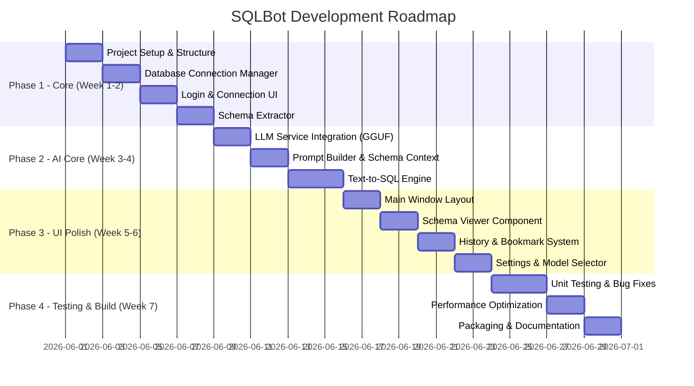

# Kế Hoạch Phát Triển Ứng Dụng Text-to-SQL Với AI Local Trên Windows (Python + Qt6)

## 📋 Tổng Quan Dự Án

**Tên dự án:** SQLBot Desktop - Ứng dụng chuyển đổi ngôn ngữ tự nhiên sang SQL sử dụng AI local

**Mục tiêu:** Xây dựng ứng dụng Windows desktop cho phép người dùng không chuyên truy vấn dữ liệu bằng tiếng Việt, với AI local chạy trên CPU, hỗ trợ đa dạng CSDL.

**Công nghệ chính:**
- **Core:** Python 3.10+
- **UI Framework:** PySide6 (Qt6 for Python)
- **AI Inference:** llama.cpp với GGUF models
- **Database Connectivity:** QtSql, SQLAlchemy, pyodbc
- **Build Tool:** PyInstaller hoặc Nuitka

---

## 🏗️ Kiến Trúc Hệ Thống (Reusable & Modular)

### 1. Cấu Trúc Dự Án Chi Tiết (Multi-Layer Architecture)

```
sqlbot_desktop/
│
├── SQLBot.sln                          # Solution file cho Visual Studio (nếu dùng)
├── pyproject.toml                      # Poetry/Modern Python config
├── requirements.txt                    
├── README.md
├── .env.example                        # Environment variables template
│
├── src/                                # Source code root
│   │
│   ├── __init__.py
│   ├── main.py                         # Entry point - Application bootstrap
│   │
│   ├── Core/                           # ========== CORE LAYER ==========
│   │   ├── __init__.py
│   │   ├── Core.Models.py              # Data classes, Enums, DTOs
│   │   ├── Core.Interfaces.py          # Abstract base classes, Contracts
│   │   ├── Core.Constants.py           # Global constants, Config keys
│   │   ├── Core.Exceptions.py          # Custom exceptions
│   │   ├── Core.Events.py              # Event bus, Application events
│   │   └── Core.Types.py               # Type aliases, Type definitions
│   │
│   ├── Infrastructure/                 # ========== INFRASTRUCTURE LAYER ==========
│   │   ├── __init__.py
│   │   ├── Infra.Database.py           # Database connections, Drivers
│   │   ├── Infra.SchemaExtractor.py    # Schema extraction from DB
│   │   ├── Infra.Repository.py         # Data persistence (History, Bookmark)
│   │   ├── Infra.FileSystem.py         # File operations, Config storage
│   │   ├── Infra.Security.py           # Encryption, Password hashing
│   │   └── Infra.Logging.py            # Logging configuration
│   │
│   ├── Services/                       # ========== BUSINESS SERVICES LAYER ==========
│   │   ├── __init__.py
│   │   ├── Svc.ConnectionManager.py    # Manage database connections
│   │   ├── Svc.QueryExecutor.py        # Execute SQL queries safely
│   │   ├── Svc.SchemaManager.py        # Load/Save schema annotations
│   │   ├── Svc.HistoryService.py       # History CRUD operations
│   │   ├── Svc.BookmarkService.py      # Bookmark CRUD operations
│   │   └── Svc.ValidationService.py    # SQL validation, Security checks
│   │
│   ├── AI/                             # ========== AI & ML LAYER ==========
│   │   ├── __init__.py
│   │   ├── AI.Models.py                # Model definitions, Config classes
│   │   ├── AI.ModelLoader.py           # Load GGUF models
│   │   ├── AI.InferenceEngine.py       # Core inference logic
│   │   ├── AI.PromptBuilder.py         # Prompt engineering utilities
│   │   ├── AI.Tokenizer.py             # Token counting, Optimization
│   │   ├── AI.Cache.py                 # Cache inference results
│   │   └── AI.Quantization.py          # Model quantization helpers
│   │
│   ├── API/                            # ========== API & EXTERNAL LAYER ==========
│   │   ├── __init__.py
│   │   ├── API.Routes.py               # Internal API endpoints (if needed)
│   │   ├── API.Middleware.py           # Request/Response processing
│   │   ├── API.Schemas.py              # Request/Response DTOs
│   │   └── API.Client.py               # External API clients (if any)
│   │
│   ├── UI/                             # ========== UI LAYER ==========
│   │   ├── __init__.py
│   │   ├── UI.MainWindow.py            # Main application window
│   │   ├── UI.AppController.py         # UI event handlers, Navigation
│   │   │
│   │   ├── Dialogs/                    # Dialog components
│   │   │   ├── __init__.py
│   │   │   ├── UI.Dlg.Login.py         # Login dialog
│   │   │   ├── UI.Dlg.Connection.py    # Connection management dialog
│   │   │   ├── UI.Dlg.SchemaEditor.py  # Schema annotation editor
│   │   │   ├── UI.Dlg.Settings.py      # Settings dialog
│   │   │   ├── UI.Dlg.Confirm.py       # Generic confirmation dialog
│   │   │   └── UI.Dlg.About.py         # About dialog
│   │   │
│   │   ├── Widgets/                    # Reusable UI components
│   │   │   ├── __init__.py
│   │   │   ├── UI.Widget.QueryInput.py # Natural language input widget
│   │   │   ├── UI.Widget.QueryResults.py # Results display table
│   │   │   ├── UI.Widget.SchemaTree.py # Schema tree viewer
│   │   │   ├── UI.Widget.HistoryPanel.py # History list panel
│   │   │   ├── UI.Widget.BookmarkPanel.py # Bookmark list panel
│   │   │   ├── UI.Widget.SqlEditor.py  # SQL editor with syntax highlight
│   │   │   └── UI.Widget.StatusBar.py  # Custom status bar
│   │   │
│   │   ├── Styles/                     # UI Styling
│   │   │   ├── UI.Style.Light.qss      # Light theme stylesheet
│   │   │   ├── UI.Style.Dark.qss       # Dark theme stylesheet
│   │   │   └── UI.Style.ThemeManager.py # Theme switching logic
│   │   │
│   │   ├── Resources/                  # Icons, Images, Fonts
│   │   │   ├── icons/                  # SVG/PNG icons
│   │   │   ├── fonts/                  # Custom fonts
│   │   │   └── UI.Resources.qrc        # Qt resource file
│   │   │
│   │   └── Utils/                      # UI-specific utilities
│   │       ├── __init__.py
│   │       ├── UI.Utils.Clipboard.py   # Clipboard operations
│   │       ├── UI.Utils.Export.py      # Export results (CSV, Excel)
│   │       └── UI.Utils.Highlighter.py # SQL syntax highlighter
│   │
│   ├── Utils/                          # ========== CROSS-CUTTING UTILITIES ==========
│   │   ├── __init__.py
│   │   ├── Utils.Threading.py          # Thread pool, Background workers
│   │   ├── Utils.Async.py              # Async/await helpers
│   │   ├── Utils.Decorators.py         # Function decorators
│   │   ├── Utils.Helpers.py            # General helper functions
│   │   ├── Utils.Validators.py         # Input validation
│   │   └── Utils.Converters.py         # Data conversion utilities
│   │
│   ├── Config/                         # ========== CONFIGURATION LAYER ==========
│   │   ├── __init__.py
│   │   ├── Config.App.py               # Application settings manager
│   │   ├── Config.Database.py          # Database config models
│   │   ├── Config.AI.py                # AI model configuration
│   │   ├── Config.Logging.py           # Logging configuration
│   │   └── Config.Profiles.py          # User profile management
│   │
│   └── Plugins/                        # ========== PLUGIN SYSTEM (Future) ==========
│       ├── __init__.py
│       ├── Plugins.Base.py             # Base plugin interface
│       ├── Plugins.Loader.py           # Plugin discovery & loading
│       └── Plugins.Examples/           # Example plugins
│           ├── Export.CSV.py           # CSV export plugin
│           └── Export.JSON.py          # JSON export plugin
│
├── tests/                              # ========== TESTING LAYER ==========
│   ├── __init__.py
│   ├── unit/                           # Unit tests
│   │   ├── test_Core.Models.py
│   │   ├── test_Infra.Database.py
│   │   ├── test_Svc.ConnectionManager.py
│   │   └── test_AI.PromptBuilder.py
│   │
│   ├── integration/                    # Integration tests
│   │   ├── test_database_flow.py
│   │   ├── test_ai_pipeline.py
│   │   └── test_ui_workflows.py
│   │
│   └── fixtures/                       # Test data
│       ├── sample_schema.json
│       ├── sample_queries.json
│       └── test_database.sqlite
│
├── models/                             # Pre-trained models storage
│   ├── qwen3-0.6b.gguf
│   ├── sqlcoder-0.5b.gguf
│   └── README.md
│
├── data/                               # Runtime data storage
│   ├── connections.json                # Encrypted connection strings
│   ├── annotations/                    # Schema annotations by connection
│   │   ├── prod_db.annotations.json
│   │   └── test_db.annotations.json
│   ├── history.db                      # SQLite - Query history
│   ├── bookmarks.db                    # SQLite - Bookmarks
│   └── logs/                           # Application logs
│       ├── app.log
│       └── error.log
│
├── scripts/                            # Build & utility scripts
│   ├── build.bat                       # Windows build script
│   ├── build.sh                        # Linux build script
│   ├── install_deps.bat                # Dependency installer
│   └── generate_resources.py           # Compile Qt resources
│
└── docs/                               # Documentation
    ├── API.md
    ├── USER_GUIDE.md
    ├── DEPLOYMENT.md
    └── ARCHITECTURE.md
```


## 🔐 Module 1: Màn Hình Đăng Nhập & Quản Lý Kết Nối

### 1.1 Giao Diện Đăng Nhập Chính

**Chức năng:**
- **Combobox chọn kết nối:** Hiển thị danh sách các CSDL đã cấu hình
- **Username/Password fields:** Đăng nhập bằng tài khoản SQL do IT cung cấp
- **Connect button:** Kết nối đến CSDL được chọn
- **Settings icon (⚙️):** Mở dialog quản lý kết nối (yêu cầu mật khẩu)

**Flow xử lý:**
```python
# Pseudo-code flow
1. User chọn connection profile từ combobox
2. Nhập username/password
3. Click Connect → gọi QSqlDatabase.addDatabase() 
4. Kiểm tra kết nối bằng db.open()
5. Nếu thành công → lưu connection object và chuyển sang Main Window
```

### 1.2 Dialog Quản Lý Kết Nối (Password Protected)

**Password mặc định:** `DPIT2026@!`

**Chức năng:**
- **Danh sách connections:** QListWidget hiển thị các connection profiles
- **Nút + (Thêm mới):** Mở dialog tạo connection
- **Nút - (Xóa):** Xóa connection đã chọn (có dialog confirm)
- **Nút Edit:** Chỉnh sửa connection hiện tại
- **Nút Test Connection:** Kiểm tra thông số kết nối

### 1.3 Dialog Tạo/Chỉnh Sửa Connection

**Thông tin cấu hình cho mỗi loại CSDL:**

| Driver | Host | Port | Database | Username | Password | Extra |
|--------|------|------|----------|----------|----------|-------|
| QSQLITE | N/A | N/A | File path | N/A | N/A | N/A |
| QMYSQL | Required | 3306 | Required | Required | Required | N/A |
| QPSQL | Required | 5432 | Required | Required | Required | N/A |
| QODBC | Required | N/A | DSN Name | Optional | Optional | Connection string |

**Các driver hỗ trợ theo QtSql :**
- `QSQLITE` - SQLite
- `QMYSQL` - MySQL/MariaDB
- `QPSQL` - PostgreSQL
- `QODBC` - Microsoft SQL Server
- `QOCI` - Oracle

**Nút "Connect & Get Schema":**
- Kết nối thử với user nhập vào
- Nếu thành công → gọi `schema_extractor.get_all_tables_columns()`
- Mở giao diện **Schema Annotation Editor**

### 1.4 Giao Diện Schema Annotation Editor

**Mục đích:** Cho phép IT nhập "diễn giải bằng ngôn ngữ tự nhiên" cho từng bảng và cột.

**Layout (Tree Structure):**
```
📁 Bảng: employees (Nhân viên)
   ├── 📄 employee_id (Mã nhân viên) [Diễn giải: Mã số định danh duy nhất]
   ├── 📄 full_name (Họ tên) [Diễn giải: Tên đầy đủ của nhân viên]
   ├── 📄 department_id (ID phòng ban) [Diễn giải: Mã số phòng ban]
   └── 📄 salary (Lương) [Diễn giải: Mức lương cơ bản, đơn vị: VND]

📁 Bảng: departments (Phòng ban)
   ├── 📄 department_id (ID phòng ban)
   └── 📄 department_name (Tên phòng ban)
```

**Chức năng:**
- Hiển thị tên bảng/cột thực tế **kèm tooltip**
- Ô nhập "Diễn giải" cho mỗi bảng và cột
- Nút "Save Annotations": Lưu vào file JSON riêng (không sửa CSDL gốc)
- Nút "Import/Export": Cho phép backup/restore annotations

---

## 🎯 Module 2: Main Window - Tính Năng Cốt Lõi

### 2.1 Layout Tổng Thể

```
┌─────────────────────────────────────────────────────────────────┐
│  [Menu Bar]          [Connection Status: ✅ Connected]          │
├─────────────────────────────────────────────────────────────────┤
│                                                                 │
│  ┌─────────────────────────────────────────────────────────┐   │
│  │  🔍 Nhập yêu cầu bằng tiếng Việt:                       │   │
│  │  ┌─────────────────────────────────────────────────────┐│   │
│  │  │ "Tính tổng lương của nhân viên phòng Kỹ thuật"      ││   │
│  │  └─────────────────────────────────────────────────────┘│   │
│  │  [✨ Generate SQL]  [📋 Copy]  [▶️ Execute]  [🔖 Bookmark]│   │
│  └─────────────────────────────────────────────────────────┘   │
│                                                                 │
│  ┌──────────────────────────┬──────────────────────────────────┐│
│  │  📝 Suggested Queries    │  📊 Query Results                ││
│  │  ┌────────────────────┐  │  ┌────────────────────────────┐  ││
│  │  │ • Query 1: SELECT  │  │  │ employee_id │ full_name │  │  ││
│  │  │   SUM(salary)...    │  │  │ 1           │ Nguyen... │  │  ││
│  │  │ • Query 2: SELECT  │  │  │ 2           │ Tran...   │  │  ││
│  │  │   department...     │  │  └────────────────────────────┘  ││
│  │  │ • Query 3: SELECT  │  │                                   ││
│  │  │   AVG(salary)...    │  │  [View as Table] [Export CSV]    ││
│  │  └────────────────────┘  │                                   ││
│  └──────────────────────────┴──────────────────────────────────┘│
│                                                                 │
│  [📚 History] [📌 Bookmarks] [🗄️ Schema] [⚙️ Settings]          │
└─────────────────────────────────────────────────────────────────┘
```

### 2.2 Text-to-SQL Generation Flow

**Luồng xử lý chi tiết :**

```python
def generate_sql(user_question: str) -> list[str]:
    # Bước 1: Lấy schema annotations đã lưu
    schema_context = get_schema_with_annotations()
    
    # Bước 2: Xây dựng prompt với few-shot examples
    prompt = PromptBuilder.build(
        question=user_question,
        schema=schema_context,
        dialect=current_db_driver,  # MySQL, PostgreSQL, etc.
        examples=get_few_shot_examples()  # Từ history thành công
    )
    
    # Bước 3: Gọi model AI (GGUF)
    responses = llm_service.generate(
        prompt=prompt,
        temperature=0.1,
        num_responses=3,  # Gợi ý 1-3 queries
        max_tokens=512
    )
    
    # Bước 4: Lọc và validate các queries
    valid_queries = []
    for sql in responses:
        if is_valid_select(sql):  # Chỉ cho phép SELECT
            valid_queries.append(sql)
    
    return valid_queries[:3]  # Tối đa 3 gợi ý
```

### 2.3 Schema Viewer Component

**Hiển thị cấu trúc CSDL với annotations:**

```python
class SchemaTreeWidget(QTreeWidget):
    """Reusable component hiển thị schema tree"""
    
    def add_table(self, table_name: str, description: str):
        table_item = QTreeWidgetItem([table_name])
        table_item.setToolTip(0, f"📝 {description}")
        table_item.setForeground(0, QColor("#2196F3"))
        
        # Font: tên bảng trên CSDL (nhỏ, màu xám)
        db_name_item = QTreeWidgetItem([f"  └─ [{table_name}]"])
        db_name_item.setForeground(0, QColor("#888888"))
        table_item.addChild(db_name_item)
        
        return table_item
```

**Kết quả hiển thị:**
```
📁 Nhân viên
   └─ [employees]          (tên table thật, chữ nhỏ màu xám)
   ├── 📄 Mã nhân viên
   │    └─ [employee_id]   (tên column thật, chữ nhỏ)
   ├── 📄 Họ tên
   │    └─ [full_name]
   └── 📄 Phòng ban ID
        └─ [department_id] (unit: int, ghi chú: khóa ngoại)
```

### 2.4 Lịch Sử (History) & Bookmarks

**Lịch sử (tối đa 100 queries):**
- Lưu trữ trong SQLite local
- Format: `{id, question, sql, timestamp, is_success}`
- Hiển thị dạng list với filter theo ngày
- Double-click để nạp lại câu hỏi vào input

**Bookmarks (không giới hạn):**
- Lưu trữ trong SQLite local
- Format: `{id, question, sql, timestamp, category, notes}`
- Có thể gắn tag/category cho bookmark
- Dialog xác nhận trước khi xóa

---

## 🤖 Module 3: AI Model Management

### 3.1 Setting Dialog - Chọn Model GGUF

**Chức năng:**
- **ComboBox danh sách models:** Quét thư mục `./models/` để tìm file `.gguf`
- **Model info display:** Hiển thị thông tin (size, quantization type)
- **Resource monitoring:** RAM usage, CPU load khi load model
- **Test Inference button:** Thử với câu query mẫu
- **Load on command:** Chỉ load khi được user thao tác.

### 3.2 Prompt Engineering cho Tiếng Việt

**System Prompt tối ưu:**

```
Bạn là chuyên gia SQL chuyển đổi câu hỏi tiếng Việt thành câu lệnh SQL.

QUY TẮC:
1. Chỉ tạo câu lệnh SELECT (KHÔNG INSERT, UPDATE, DELETE, DROP)
2. Sử dụng đúng tên bảng và cột từ schema được cung cấp
3. Với tiếng Việt có dấu, giữ nguyên như trong database
4. Ưu tiên sử dụng JOIN thay vì subquery khi có thể
5. Thêm comment giải thích logic nếu query phức tạp

ĐẦU RA:
Chỉ trả về câu lệnh SQL, không giải thích thêm.
```

**Few-shot examples cho tiếng Việt:**

```python
FEW_SHOT_EXAMPLES = [
    {
        "question": "Liệt kê tên và lương của nhân viên phòng Kế toán",
        "sql": """
        SELECT nv.ho_ten, nv.luong
        FROM nhan_vien nv
        JOIN phong_ban pb ON nv.phong_ban_id = pb.id
        WHERE pb.ten_phong = N'Kế toán'
        """
    },
    {
        "question": "Tính tổng doanh thu theo từng tháng trong năm 2025",
        "sql": """
        SELECT 
            strftime('%m', ngay_tao) as thang,
            SUM(tong_tien) as tong_doanh_thu
        FROM don_hang
        WHERE strftime('%Y', ngay_tao) = '2025'
        GROUP BY strftime('%m', ngay_tao)
        ORDER BY thang
        """
    }
]
```

---

## 🗄️ Module 4: Database Connectivity & Schema Extraction

### 4.1 Connection Manager (Reusable)

**Sử dụng QtSql :**

```python
from PySide6.QtSql import QSqlDatabase, QSqlQuery

class DatabaseManager:
    def __init__(self):
        self.connections = {}  # Lưu các connection profiles
        self.active_db = None
        
    def add_connection(self, name: str, config: dict):
        """Tạo connection mới với driver tương ứng"""
        db = QSqlDatabase.addDatabase(config['driver'], name)
        db.setHostName(config.get('host', ''))
        db.setDatabaseName(config['database'])
        db.setUserName(config['username'])
        db.setPassword(config['password'])
        db.setPort(config.get('port', -1))
        
        self.connections[name] = db
        
    def connect(self, name: str) -> bool:
        """Mở kết nối đến database"""
        db = self.connections.get(name)
        if db and db.open():
            self.active_db = db
            return True
        return False
```

### 4.2 Schema Extractor (Đa CSDL)

**Lấy danh sách bảng và cột:**

```python
class SchemaExtractor:
    def __init__(self, db_connection):
        self.db = db_connection
        
    def get_tables(self) -> list[TableInfo]:
        """Lấy danh sách tables (hoạt động với mọi CSDL)"""
        tables = []
        
        # Sử dụng QtSql để lấy metadata
        query = QSqlQuery(self.db)
        
        # Cách 1: Dùng INFORMATION_SCHEMA cho các DB hỗ trợ
        query.exec("""
            SELECT table_name 
            FROM information_schema.tables 
            WHERE table_type = 'BASE TABLE'
        """)
        
        # Cách 2: Fallback với driver-specific
        # QSQLITE: SELECT name FROM sqlite_master WHERE type='table'
        # QPSQL: SELECT tablename FROM pg_tables
        
        while query.next():
            table_name = query.value(0)
            columns = self.get_columns(table_name)
            tables.append(TableInfo(table_name, columns))
            
        return tables
    
    def get_columns(self, table_name: str) -> list[ColumnInfo]:
        """Lấy chi tiết các cột trong bảng"""
        columns = []
        query = QSqlQuery(self.db)
        
        # Driver-agnostic approach
        record = self.db.record(table_name)
        for i in range(record.count()):
            columns.append(ColumnInfo(
                name=record.fieldName(i),
                type=record.field(i).typeName(),
                is_nullable=record.isNull(i),
                # primary_key, foreign_key info có thể lấy từ metadata driver
            ))
        
        return columns
```

### 4.3 Annotation Storage

**Lưu annotations dưới dạng JSON:**
```json
{
  "connection_name": "production_db",
  "tables": {
    "employees": {
      "description": "Danh sách nhân viên công ty",
      "columns": {
        "employee_id": {
          "description": "Mã số nhân viên duy nhất",
          "unit": "",
          "note": "Khóa chính"
        },
        "full_name": {
          "description": "Họ và tên đầy đủ",
          "unit": "",
          "note": "Format: Họ Tên Đệm Tên"
        },
        "salary": {
          "description": "Mức lương cơ bản",
          "unit": "VND",
          "note": "Chưa bao gồm thưởng"
        }
      }
    }
  }
}
```

---

## 🧩 Module 5: Reusable UI Components (Abstract-GUI Pattern)

**Sử dụng Abstract-GUI để tái sử dụng :**

### 5.1 Reactive Widget Base Class

```python
from abstract_gui.QT6.widgets import createButton, createTable
from PySide6.QtCore import QObject, Signal

class ReactiveWidget(QWidget):
    """Base class cho tất cả widgets với reactive pattern"""
    
    state_changed = Signal(dict)
    
    def __init__(self, parent=None):
        super().__init__(parent)
        self._state = {}
        
    def set_state(self, key: str, value):
        self._state[key] = value
        self.state_changed.emit({key: value})
        self.on_state_change(key, value)
        
    def on_state_change(self, key: str, value):
        """Override để xử lý state change"""
        pass
```

### 5.2 Widget Factories

```python
# Tạo button với styling consistent
from abstract_gui.QT6.factories import createButton

btn_generate = createButton(
    parent=self,
    layout=layout,
    label="✨ Generate SQL",
    connect=self.on_generate_clicked,
    props={
        "minimumWidth": 120,
        "objectName": "primaryButton"
    }
)

# Tạo table với data binding
from abstract_gui.QT6.factories import createTable

results_table = createTable(
    parent=self,
    data=query_results,
    headers=["ID", "Name", "Department"],
    connect=self.on_table_cell_clicked,
    props={"alternatingRowColors": True}
)
```

### 5.3 Threading Utilities cho AI Inference

```python
from PySide6.QtCore import QThread, Signal
from abstract_gui.QT6.utils.thread_utils import BackgroundWorker

class SQLGenerationWorker(BackgroundWorker):
    """Worker chạy AI inference trong background thread"""
    
    result_ready = Signal(list)
    progress = Signal(int)
    
    def __init__(self, question: str, schema: str, model):
        super().__init__()
        self.question = question
        self.schema = schema
        self.model = model
        
    def run(self):
        self.progress.emit(10)
        # Gọi model inference (blocking operation)
        sql_queries = self.model.generate(self.question, self.schema)
        self.progress.emit(100)
        self.result_ready.emit(sql_queries)
```

---

## 🔧 Module 6: Additional Features & Enhancements

### 6.1 Query Validation & Security

```python
class QueryValidator:
    @staticmethod
    def is_readonly(sql: str) -> bool:
        """Kiểm tra query có an toàn (chỉ SELECT) không"""
        sql_lower = sql.strip().lower()
        
        # Danh sách keywords bị cấm
        dangerous_keywords = [
            'insert', 'update', 'delete', 'drop', 
            'alter', 'create', 'truncate', 'exec'
        ]
        
        # Phải bắt đầu bằng SELECT
        if not sql_lower.startswith('select'):
            return False
            
        # Kiểm tra không có dangerous keywords
        for keyword in dangerous_keywords:
            if keyword in sql_lower.split():
                return False
                
        return True
```

### 6.2 Export Results

- **Export to CSV:** Sử dụng `csv` module
- **Export to Excel:** Sử dụng `openpyxl`
- **Copy to Clipboard:** Qt's `QGuiApplication.clipboard()`

### 6.3 Dark/Light Theme Toggle

**Sử dụng QSS để switch theme:**

```python
# light_theme.qss
QWidget { background-color: #f5f5f5; color: #333333; }
QPushButton#primaryButton { background-color: #2196F3; color: white; }

# dark_theme.qss  
QWidget { background-color: #1e1e1e; color: #d4d4d4; }
QPushButton#primaryButton { background-color: #0d47a1; color: white; }
```

### 6.4 Auto-complete cho Input Field

- Gợi ý câu hỏi dựa trên lịch sử
- Sử dụng `QCompleter` với QStringListModel

### 6.5 System Tray Integration

- Chạy ngầm, nhấn vào icon để hiện window
- Thông báo khi có query mới được bookmark

---

## 📦 Module 7: Build & Distribution

### 7.1 Requirements.txt

```
PySide6>=6.6.0
llama-cpp-python>=0.2.0
sqlalchemy>=2.0.0
pyodbc>=5.0.0
pymysql>=1.1.0
psycopg2-binary>=2.9.0
openpyxl>=3.1.0
cryptography>=41.0.0
abstract-gui>=0.0.62
pyinstaller>=6.0.0
```

### 7.2 Build với PyInstaller

```bash
pyinstaller --name="SQLBot" \
            --windowed \
            --icon=resources/icon.ico \
            --add-data "src/ui/styles/*:ui/styles" \
            --add-data "src/ui/resources/*:ui/resources" \
            --hidden-import=PySide6.QtSql \
            --hidden-import=llama_cpp \
            run.py
```

### 7.3 Cấu Hình Portable Mode

- Tất cả config, models, lịch sử lưu trong thư mục `%APPDATA%/SQLBot/`
- Hoặc cho phép portable: lưu trong thư mục app

---

## 🎯 Gợi ý Bổ Sung (Enhancements)

1. **Smart Schema Caching:** Cache schema và annotations để tăng tốc độ load
2. **Query Explanation Mode:** Giải thích câu SQL đã sinh ra bằng tiếng Việt
3. **Natural Language Filter Builder:** Cho phép user xây dựng filter bằng UI thay vì nhập text
4. **Multi-database Query Federation:** Cho phép query cross-database (nếu có nhiều kết nối)
5. **Query Performance Insights:** Hiển thị EXPLAIN plan cho các query phức tạp
6. **Team Sync:** Cho phép chia sẻ annotations và bookmarks qua network share
7. **Voice Input:** Thêm microphone button để nhập câu hỏi bằng giọng nói (sử dụng speech_recognition)
8. **Auto-complete SQL:** Khi user tự tay sửa query, hỗ trợ auto-complete tên bảng/cột

---

## 📊 Lộ Trình Phát Triển (Gantt Chart)



---

## 🔐 Security Considerations

1. **Encrypted Connection Strings:** Mã hóa mật khẩu lưu trong config file sử dụng `cryptography.fernet`
2. **Master Password:** Yêu cầu mật khẩu master để giải mã connection strings
3. **Audit Log:** Ghi log tất cả các query được thực thi (user, timestamp, SQL)
4. **Row-level Security:** Nếu cần, thêm filter tự động dựa trên quyền user

---

## 📈 Performance Targets (với i5-11/16GB)

- **Model Load Time:** < 5 seconds cho model 1B
- **Inference Time:** < 3 seconds cho câu query đơn giản
- **UI Responsiveness:** < 100ms cho các thao tác UI (nhờ threading)
- **Memory Usage:** < 4GB RAM total (app + model + database)